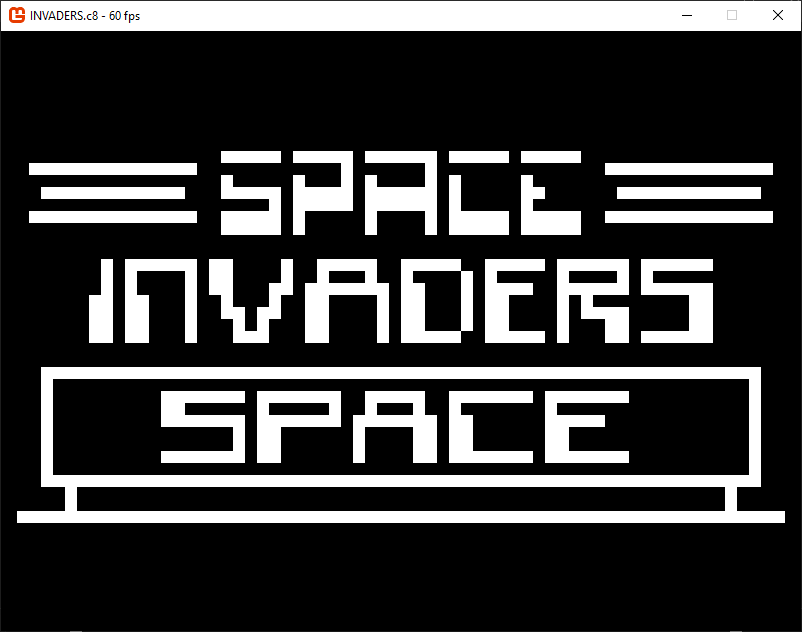
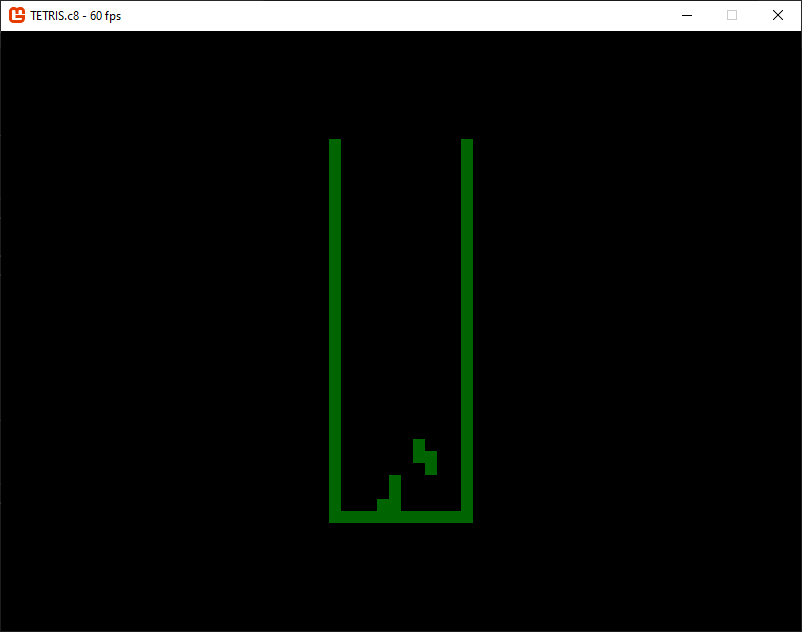

# Shark Emulator (Chip8 - CSharp version)

This is a Chip8 emulator implemented in C# using MonoGame render.

*Workflow build Windows, Linux and MacOS executable, but only Windows is currently tested.*

## Command line arguments

```
SharkE.Chip8 1.0.0
  -r, --rom                 Required. Rom file
  -w, --window              Window mode
  -s, --screenresolution    Screen resolution (ex: 800x600)
  -m, --rendermode          Render mode (Center, PixelPerfect, Fill)
  -t, --theme               Theme index
  --help                    Display this help screen.
  --version                 Display version information.
```

## Special keys

```
[ESC] : Exit game
[F6] : Change palette
[F7] : Switch to center mode
[F8] : Switch to fill mode
[F9] : Switch to pixel perfect mode
[F10] : Switch full screen
```
## Keyboard
Chip8 layout:
| 1 | 2 | 3 | C |
|---|---|---|---|
| 4 | 5 | 6 | D |
| 7 | 8 | 9 | E |
| A | 0 | B | F |

Emulator mapping:
| 1 | 2 | 3 | 4 |
|---|---|---|---|
| Q | W | E | R |
| A | S | D | F |
| Z | X | C | V |

## Screenshots




## Documentations
 - https://en.wikipedia.org/wiki/CHIP-8
 - http://devernay.free.fr/hacks/chip8/C8TECH10.HTM
 - https://multigesture.net/articles/how-to-write-an-emulator-chip-8-interpreter/

## Tests
 - https://github.com/corax89/chip8-test-rom
 - https://github.com/Skosulor/c8int/tree/master/test
 
 ## Roms
  - https://www.zophar.net/pdroms/chip8/chip-8-games-pack.html
